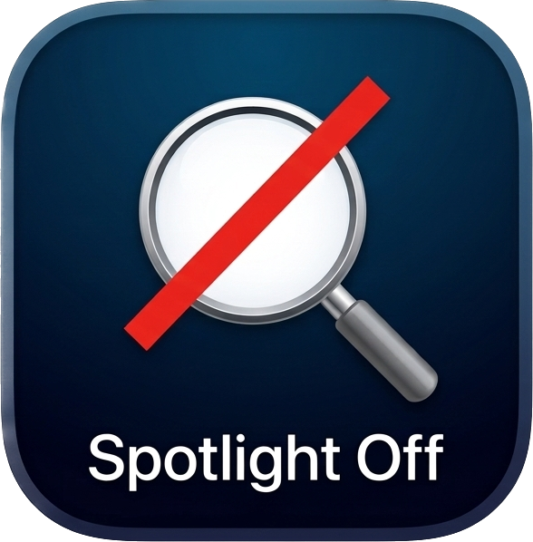

<div align="center">
  

  # Spotlight Off

  **Automatically disables Spotlight indexing on external drives the moment they're connected.**

  
  
  

</div>

---

## What it does

Every time you plug in an external drive, macOS quietly starts building a Spotlight index on it — consuming disk space and I/O you didn't ask for. **Spotlight Off** sits in your menu bar and takes care of it automatically.

- 🔌 **Detects** any external drive the moment it's mounted
- 🔍 **Checks** whether Spotlight indexing is currently enabled
- 🚫 **Disables** it instantly using `mdutil`, with a one-time admin prompt
- 📋 **Logs** every action in a live activity log inside the app
- 🚀 **Launches at login** so it's always running in the background

---

## Screenshot

> *(Add a screenshot of the menu bar and settings window here)*

---

## Installation

1. Download the latest release from the [Releases](../../releases) page
2. Move **Spotlight Off.app** to your `/Applications` folder
3. Launch it — the icon will appear in your menu bar
4. On first use, macOS will ask for administrator approval to run `mdutil`
5. Optionally enable **Launch at Login** in the settings window

### First-time permission

macOS requires explicit permission to access removable volumes. When prompted, click **Allow** — this only happens once per drive. You can also pre-grant access for all removable volumes:

> **System Settings → Privacy & Security → Files and Folders → Spotlight Off → Enable Removable Volumes**

---

## Usage

| Action | How |
|---|---|
| See recently processed drives | Click the menu bar icon |
| Open full history & settings | Click **History & Settings…** or press ⌘, |
| Remove a history entry | Select it in the list and press Delete |
| Clear all history | Click **Clear All** in the settings window |
| Enable launch at login | Toggle in the settings window |
| View activity log | Scroll to the bottom of the settings window |
| Quit | Click **Quit Spotlight Off** in the menu |

---

## How it works

When a volume mounts, Spotlight Off:

1. Reads the volume's metadata flags to confirm it's a local, non-root external volume
2. Waits 1.5 seconds for the volume to fully settle
3. Runs `mdutil -s` to check whether indexing is currently enabled
4. If enabled, runs `mdutil -i off` via `osascript` with administrator privileges
5. Records the result in the persistent history log

All history is stored locally in `UserDefaults`. No network requests are ever made.

---

## Requirements

- macOS 13 Ventura or later
- Administrator access (required once, to run `mdutil`)

---

## Building from source

```bash
git clone https://github.com/titleunknown/Spotlight-Off.git
cd Spotlight-Off
open "Spotlight Off.xcodeproj"
```

Select your development team in **Signing & Capabilities**, then build and run.

---

## License

MIT — see [LICENSE](LICENSE) for details.
