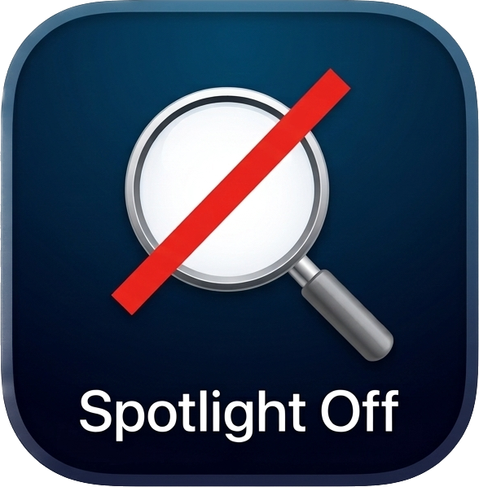

<div align="center">
  

  # Spotlight Off

  **Automatically disables Spotlight indexing on external drives the moment they're connected.**

  
  
  
  

</div>

---

## What it does

Every time you plug in an external drive, macOS quietly starts building a Spotlight index on it — consuming disk space and I/O you didn't ask for. **Spotlight Off** sits in your menu bar and takes care of it automatically.

- 🔌 **Detects** any external drive the moment it's mounted
- 🔍 **Checks** whether Spotlight indexing is currently enabled
- 🚫 **Disables** it instantly using `mdutil` — no password prompt required
- 🔁 **Catches drives already connected** when it starts, not just new ones
- ✅ **Remembers exceptions** — re-enable Spotlight on a drive and it stays on
- 🧹 **Cleans up** — optionally removes the old Spotlight index to free space, removes `._` and `.DS_Store` clutter, and can stop Finder writing `.DS_Store` files on external drives
- 🧾 **Logs** every action in a colour-coded activity log (saved to `~/Library/Logs/Spotlight Off`), filterable to failures only
- 🔔 **Notifies** you with a macOS notification (respects Focus) or a subtle pop-up when a drive is processed
- 🚀 **Launches at login** so it's always running in the background
- 👋 **Setup checklist** shows live status for the one required permission (and the app warns you if it's ever missing), plus a **Help** tab explaining indexing, the cleanup actions and troubleshooting

Works with **APFS, HFS+, and exFAT** volumes — external drives, USB card readers, and SD cards in the MacBook's built-in SD card slot. Disk images (.dmg files) and Time Machine volumes are automatically ignored.

---

## Screenshot


---

## Installation

1. Download the latest release from the [Releases](https://github.com/titleunknown/Spotlight-Off/releases) page
2. Move **Spotlight Off.app** to your `/Applications` folder
3. Launch it — the icon will appear in your menu bar
4. On first launch the settings window opens on the **Setup** tab, which walks you through the one required permission
5. Optionally enable **Launch at Login** in the settings window

---

## First-time setup

Spotlight Off only needs one permission: **Full Disk Access**.

### Full Disk Access

Open **System Settings → Privacy & Security → Full Disk Access** and make sure **Spotlight Off** is toggled on. That's it — no admin password prompt, no additional tools needed.

> Full Disk Access is what allows `mdutil` to disable Spotlight indexing without requiring root. Once granted, drives are processed automatically and silently every time they connect.

> You can return to the checklist any time via the menu bar icon → **History & Settings…** → **Setup**

---

## Usage

| Action | How |
|---|---|
| See connected and recently processed drives | Click the menu bar icon |
| Act on a connected drive | Menu bar icon → the drive's name, or the **…** menu next to it in settings |
| Open full history & settings | Click **History & Settings…** or press ⌘, |
| Reopen the setup checklist | **Setup** tab in the settings window |
| Learn how it works / troubleshoot | **Help** tab in the settings window |
| Turn Spotlight back on for a drive (and keep it on) | Click **Re-enable** in the Drives tab |
| Free the space used by an old Spotlight index | **Remove Spotlight Index…** in a drive's menu, or turn on **Also remove the existing Spotlight index** |
| Remove `._` and `.DS_Store` files from a drive | **Remove macOS Clutter…** in a drive's menu |
| Stop Finder writing `.DS_Store` files on external drives | Toggle in the Settings tab, then relaunch Finder |
| Let the app manage a re-enabled drive again | Click **Forget** under Allowed to Index |
| Remove a history entry | Hover over it in the list and click the ✕ button |
| Clear all history | Click **Clear All** in the Drives tab |
| Enable launch at login | Toggle in the Settings tab |
| View activity log | Click the **Activity Log** tab in the settings window |
| Copy or open the activity log | Click **Copy** or **Log File** in the Activity Log tab |
| Quit | Click **Quit Spotlight Off** in the menu |

---

## How it works

When a volume mounts (or is already mounted when the app starts), Spotlight Off:

1. Ignores disk images, Time Machine volumes, and internal (non-removable) or virtual volumes, plus any drive you've re-enabled indexing on
2. Reads the volume's metadata flags to confirm it's a local, non-root volume that's either external or removable (the built-in SD card reader reports cards as internal but removable)
3. Waits 4 seconds for the volume to fully initialise
4. Runs `mdutil -s` to check whether indexing is currently enabled
5. If enabled, runs `mdutil -i off` directly — no shell, no escalation
6. Optionally deletes the `.Spotlight-V100` index folder macOS already built on the drive
7. Records the result in the activity log and persistent history

Full Disk Access grants `mdutil` the permissions it needs to disable indexing without requiring root. History is stored locally in `UserDefaults` and the activity log in `~/Library/Logs/Spotlight Off/activity.log`. The only network request the app makes is a check for updates against the GitHub Releases API — about once a day, or when you click **Check Now**. It sends nothing about you or your drives, and you can turn automatic checks off in settings.

---

## Requirements

- macOS 14 Sonoma or later
- Full Disk Access (granted once in System Settings)

---

## Building from source

```bash
git clone https://github.com/titleunknown/Spotlight-Off.git
cd Spotlight-Off
open "Spotlight Off.xcodeproj"
```

Set your deployment target to **macOS 14.0**, select your development team in **Signing & Capabilities**, then build and run.

---

## Support development

Spotlight Off is free and open source. If it saves you time, consider buying me a coffee ☕

<div align="center">

  [](https://www.paypal.com/donate/?hosted_button_id=AEY7AC82BKH5C)
  [](https://account.venmo.com/u/FAINI)
  [](https://buymeacoffee.com/fainimade)

</div>

---

## License

Spotlight Off is licensed under [CC BY-NC 4.0](https://creativecommons.org/licenses/by-nc/4.0/). Free for personal and non-commercial use. For commercial licensing contact [fainimade.com](https://www.fainimade.com).
